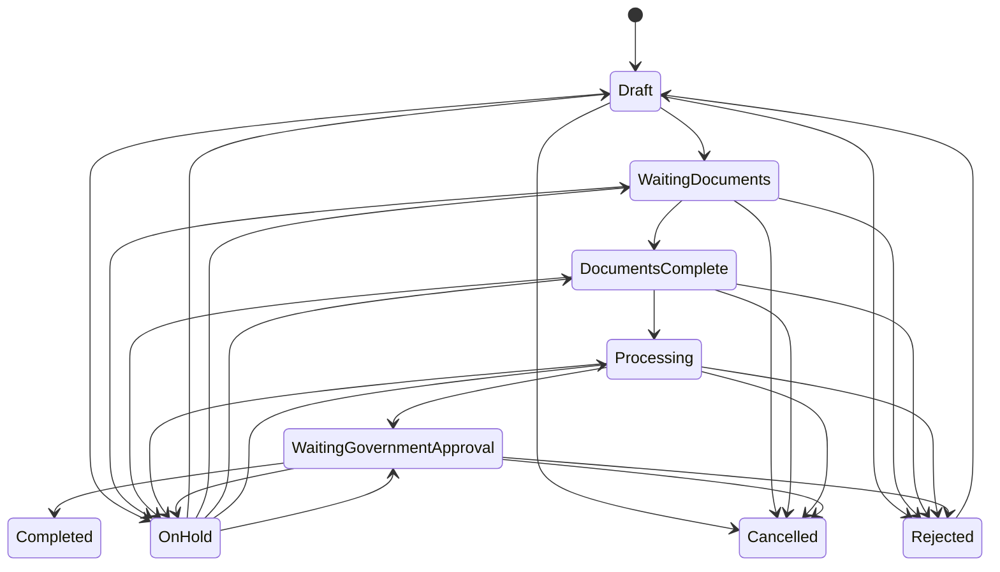
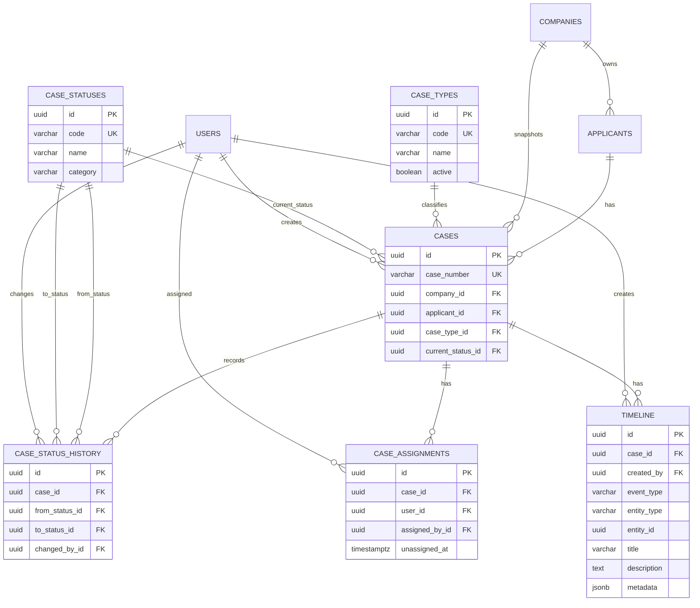

# WP003A — Case Domain Foundation

**Status:** Approved for WP004 implementation.

This document is the source of truth for the Case domain.

## Confirmed domain rules

- An applicant can have multiple cases.
- Each case belongs to exactly one applicant.
- A case has multiple documents, tasks, and timeline events.
- Case types must use a table, not a database enum.
- Case statuses must use a table, not a database enum.
- `users` is a foundation-only table for foreign keys and audit trails; authentication and RBAC are out of scope for WP004.
- Initial case types are: Visa Application, Visa Extension, Work Permit, Work Permit Renewal, 90-Day Report, Re-Entry Permit, Passport Renewal Support, and Other.
- Primary workflow: Draft → Waiting Documents → Documents Complete → Processing → Waiting Government Approval → Completed.
- Completed and Cancelled are terminal states.
- Rejected can be reopened.
- On Hold can return to any active state.

## Tables

### `cases`

| Column | Type | Rule |
| --- | --- | --- |
| id | UUID | Primary key |
| case_number | varchar(32) | Unique human-readable identifier |
| company_id | UUID | Required FK to `companies.id`; must match the applicant's company |
| applicant_id | UUID | Required FK to `applicants.id` |
| case_type_id | UUID | Required FK to `case_types.id` |
| current_status_id | UUID | Required FK to `case_statuses.id` |
| created_by_id | UUID | Required FK to `users.id`; enforcement awaits authentication design |
| opened_at | timestamptz | Required |
| completed_at | timestamptz | Null unless completed |
| created_at / updated_at | timestamptz | Audit timestamps |

### `case_types`

| Column | Type | Rule |
| --- | --- | --- |
| id | UUID | Primary key |
| code | varchar(64) | Unique, stable machine identifier |
| name | varchar(255) | Display name |
| active | boolean | Allows future configuration without deleting history |
| sort_order | integer | Display ordering |
| created_at / updated_at | timestamptz | Audit timestamps |

Seed values: `VISA_APPLICATION`, `VISA_EXTENSION`, `WORK_PERMIT`, `WORK_PERMIT_RENEWAL`, `NINETY_DAY_REPORT`, `RE_ENTRY_PERMIT`, `PASSPORT_RENEWAL_SUPPORT`, `OTHER`.

### `case_statuses`

| Column | Type | Rule |
| --- | --- | --- |
| id | UUID | Primary key |
| code | varchar(64) | Unique, stable machine identifier |
| name | varchar(255) | Display name |
| category | varchar(32) | `ACTIVE`, `TERMINAL`, or `PAUSED` |
| active | boolean | Allows future configuration without deleting history |
| sort_order | integer | Display ordering |
| created_at / updated_at | timestamptz | Audit timestamps |

Seed values: `DRAFT`, `WAITING_DOCUMENTS`, `DOCUMENTS_COMPLETE`, `PROCESSING`, `WAITING_GOVERNMENT_APPROVAL`, `COMPLETED`, `ON_HOLD`, `CANCELLED`, `REJECTED`.

### `case_status_history`

| Column | Type | Rule |
| --- | --- | --- |
| id | UUID | Primary key |
| case_id | UUID | Required FK to `cases.id` |
| from_status_id | UUID | Nullable for the initial status |
| to_status_id | UUID | Required FK to `case_statuses.id` |
| changed_by_id | UUID | Required FK to `users.id`; enforcement awaits authentication design |
| reason | text | Required for On Hold, Cancelled, and Rejected transitions |
| changed_at | timestamptz | Required |

This is append-only history. The current status is stored separately on `cases` for efficient reads.

### `case_assignments`

| Column | Type | Rule |
| --- | --- | --- |
| id | UUID | Primary key |
| case_id | UUID | Required FK to `cases.id` |
| user_id | UUID | Required FK to `users.id` |
| assigned_by_id | UUID | Required FK to `users.id` |
| assigned_at | timestamptz | Required |
| unassigned_at | timestamptz | Nullable; marks assignment as inactive |

A case has at most one active assignment. Historical assignments are retained rather than overwritten.

### `timeline`

| Column | Type | Rule |
| --- | --- | --- |
| id | UUID | Primary key |
| case_id | UUID | Required FK to `cases.id` |
| created_by | UUID | Nullable FK to `users.id` for system-generated events |
| event_type | varchar(64) | Stable machine identifier |
| entity_type | varchar(64) | String entity type, for example `CASE`, `DOCUMENT`, `TASK`, or `APPLICANT` |
| entity_id | UUID | Nullable referenced entity identifier |
| title | varchar(255) | Human-readable event title |
| description | text | Optional human-readable detail |
| metadata | jsonb | Structured, event-specific metadata |
| created_at | timestamptz | Required |

Timeline is a generic, append-only event log. Records are never updated or deleted, and business modules must create them through `TimelineService` only. `event_type` remains a string; supported values include `CASE_CREATED`, `STATUS_CHANGED`, `ASSIGNMENT_CHANGED`, `DOCUMENT_UPLOADED`, `TASK_CREATED`, `TASK_COMPLETED`, `OCR_COMPLETED`, `AI_EXTRACTION_COMPLETED`, and `COMMENT_ADDED`.

Metadata examples:

- Status change: `{"oldStatus":"PROCESSING","newStatus":"ON_HOLD","reason":"Missing passport"}`
- Assignment: `{"oldUser":"…","newUser":"…"}`
- Case created: `{"caseNumber":"GW-2026-00001"}`

## Case number

### Approved format

`GW-YYYY-#####`

Example: `GW-2026-00001`.

- `GW` is the GlobalWork prefix.
- `YYYY` is the calendar year at creation.
- `#####` is a five-digit sequence that restarts each calendar year.
- A database uniqueness constraint must cover `case_number`.

The sequence restarts each calendar year. Case type does not appear in the number. Imported-case handling is deferred because no import requirement has been supplied.

## Business rules

1. A case cannot exist without an applicant, type, and current status.
2. An applicant belongs to exactly one company. A Case stores `company_id` explicitly, and it must equal `applicants.company_id` at creation.
3. Creating a case creates one `case_status_history` row with `from_status_id = null` and `to_status_id = DRAFT`.
4. Every status transition updates `cases.current_status_id`, inserts one history record, and writes a timeline event in one database transaction.
5. A terminal case cannot transition to another status. This applies to Completed and Cancelled.
6. A Rejected case may be reopened only to `Draft`.
7. An On Hold case may transition to any active status.
8. The actor and reason are required for every manually initiated status transition; a reason is mandatory for On Hold, Cancelled, and Rejected.
9. Only one `case_assignments` row may be active for a case at a time.
10. Assignment, unassignment, status transition, document action, and task action must add a timeline event.
11. Case type and status seed rows may be deactivated but must not be deleted while referenced by a case.

## State diagram

Cancelled and Rejected are allowed from any primary active status.

## ER diagram

